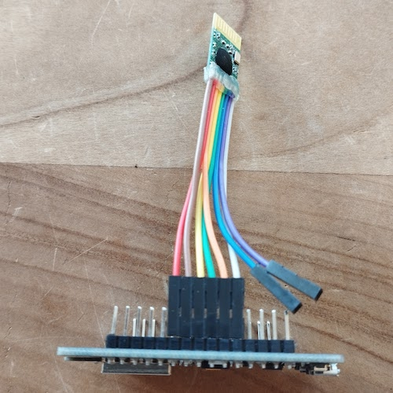

# Philips LivingColors 1st generation component for ESPHome.

[![GitHub Release][releases-shield]][releases]
[![Licence][license-shield]][license]
[![Maintainer][maintainer-shield]][maintainer]  
[![GitHub Sponsors][github-shield]][github]
[![PayPal][paypal-shield]][paypal]
[![BuyMeCoffee][buymecoffee-shield]][buymecoffee]
[![Patreon][patreon-shield]][patreon]

## Introduction

This [ESPHome External Component](https://esphome.io/components/external_components) can emulate
the Philips LivingColors 1st generation LED light and accompanying remote control.

[](https://youtu.be/AeJ-u4nzVQo "Watch the video")

Features:
- Sending commands to the LivingColors LED light
- Receiving commands from LivingColors LED light and LivingColors remote control
- Enable native color cycling light effect
- Pair/unpair LivingColors LED light

### Identifying a 1st generation LivingColors LED light

This ESPHome component only works with the 1st generation of LivingColors LED lights, not with the
2nd generation or later. A 1st generation can be recognised by the 4 LEDs (2 red, 1 green, 1 blue)
and a power supply which gives 5.6 Volts. The 1st generation remote control is not marked as such.

|      |1st generation|2nd generation|
|-----:|:------------:|:------------:|
|LEDs  |    4 LEDs    |    7 LEDs    |
|Power |   5.6 Volt   |  18.5 Volt   |
|Remote|  No marking  |     GEN2     |

## Hardware required

- Philips LivingColors 1st generation LED light
- ESP8266, ESP32 or other ESPHome supported microcontroller
- CC2500 transceiver module

## Wiring

The solderpads of the CC2500 transceiver are just a bit closer spaced than the width of a ribbon
cable, you need a steady hand to solder the wires.



But I've created a Wemos mini Shield that is tested with the D1 mini and C3 mini. Contact me if you
like to buy one!


|     CC2500      |Wemos D1 mini<br/>Shield V2|Wemos C3 mini<br/>Shield V2|
|:---------------:|:-------------:|:-------------:|
|       GND       |      GND      |      GND      |
|       VDD       |      3V3      |      3V3      |
|       SI        |     GPIO13    |     GPIO4     |
|      SCLK       |     GPIO14    |     GPIO2     |
|       SO        |     GPIO12    |     GPIO3     |
| GDO2 (interrupt)|     GPIO15    |     GPIO5     |
|      GDO0       |       A0      |     GPIO0     |
|       CSn       |     GPIO16    |     GPIO1     |

For other configurations you can check the [ESPHome CC2500 component](https://github.com/rrooggiieerr/esphome-cc2500).

## LivingColors 1st generation commands

The data needed to control the LivingColors LED light consist of a 14 byte packet which contains:
- 4 byte light address
- 4 byte remote address
- 1 byte fixed value, always 0x11
- 1 byte command
- 1 byte serial number, increases by 1 on every transmit
- 3 byte HSV color data

## ESPHome example configuration

To set up this LivingColors component you first need to place a top-level SPI and CC2500 component
which defines the GPIO pins to use.

Example YAML for Wemos C3 mini and CC2500 shield:

```
esphome:
  name: livingcolors1
  friendly_name: LivingColors 1st generation

external_components:
  - source:
      type: git
      url: https://github.com/rrooggiieerr/esphome-cc2500
      # ref: 0.0.3
    components: [cc2500]
  - source:
      type: git
      url: https://github.com/rrooggiieerr/esphome-livingcolors1
      # ref: 0.0.3
    components: [livingcolors1]

esp32:
  board: lolin_c3_mini
  variant: esp32c3

# Enable logging
logger:
  level: INFO

# Enable Home Assistant API
api:
  encryption:
    key: ...

ota:
  - platform: esphome
    password: ...

wifi:
  ssid: !secret wifi_ssid
  password: !secret wifi_password
```

CC2500 settings for Wemos D1 mini and CC2500 Shield V2.0

```
spi:
  clk_pin: GPIO14
  mosi_pin: GPIO13
  miso_pin: GPIO12

cc2500:
  cs_pin: GPIO16
  gdo0_pin: A0
  gdo2_pin: GPIO15 # Interrupt
  output_power: 0xFF
```

SPI settings for Wemos C3 mini and CC2500 Shield V2.0

```
spi:
  clk_pin: GPIO2
  mosi_pin: GPIO4
  miso_pin: GPIO3

cc2500:
  cs_pin: GPIO1
  gdo0_pin: GPIO0
  gdo2_pin: GPIO5 # Interrupt
  output_power: 0xFF
```

LivingColors settings

```
livingcolors1:

button:
  - platform: livingcolors1
    address: 0x...
    pair:
      name: "Pair LivingColors"
    unpair:
      name: "Unpair LivingColors"

light:
  - platform: livingcolors1
    name: "LivingColors"
    address: 0x...
    restore_mode: RESTORE_DEFAULT_OFF
```

## Detecting the LivingColors address

There are two ways to detect the address needed to send and receive LivingColors commands. In both
cases you need to enable info loglevel in your ESPHome configuration and keep the log console open.
When a new LivingColors address is detected the address will be printed to the ESPHome console.

### Use the LivingColors remote control

Flash your ESP with the above example configuration YAML except for the button and light
components. Control your LivingColors LED light with the LivingColors remote control, it doesn't
really matter in which way you control it. Switching on/off or changing the color, anything does.
When the LivingColors component detects the command it will print the address to the logging
console.

You can now use this address in the button and light components.

### Pairing the LivingColors LED light from the ESP

This method is particularly useful if you don't have the remote control. Flash your ESP with the
above example configuration YAML except for the light component, you can use any 8 byte address (16
character hexadecimal) for the button configuration, only the last 4 bytes really matter. Keep the
ESP with CC2500 module close to the LivingColors LED light. When clicking the Pair LivingColors
button the address will be printed to the logging console when pairing was successful.

You can now use this address in the light component.

## Improve commmand receiption

If your LivingColors LED light skips commands the distance between the light and the CC2500 module
might be on the limit resulting in range issues. You can increasing the number of commands repeats
the code sends by setting the `send_repeats` parameter of the `light` component. The default number
of repeats is 7, just like the LivingColors remote is sending.

```
light:
  - platform: livingcolors1
    name: "LivingColors"
    address: 0x...
    send_repeats: 15
    restore_mode: RESTORE_DEFAULT_OFF
```

## Support my work

Do you enjoy using this ESPHome component? Then consider supporting my work using one of the
following platforms, your donation is greatly appreciated and keeps me motivated:

[![GitHub Sponsors][github-shield]][github]
[![PayPal][paypal-shield]][paypal]
[![BuyMeCoffee][buymecoffee-shield]][buymecoffee]
[![Patreon][patreon-shield]][patreon]

## Hire me

If you're in need for a freelance ESP developer for your project please contact me, you can find my
email address on [my GitHub profile](https://github.com/rrooggiieerr).

[releases]: https://github.com/rrooggiieerr/esphome-livingcolors1/releases
[releases-shield]: https://img.shields.io/github/v/release/rrooggiieerr/esphome-livingcolors1?style=for-the-badge
[license]: ./LICENSE
[license-shield]: https://img.shields.io/github/license/rrooggiieerr/esphome-livingcolors1?style=for-the-badge
[maintainer]: https://github.com/rrooggiieerr
[maintainer-shield]: https://img.shields.io/badge/MAINTAINER-%40rrooggiieerr-41BDF5?style=for-the-badge
[paypal]: https://paypal.me/seekingtheedge
[paypal-shield]: https://img.shields.io/badge/PayPal-00457C?style=for-the-badge&logo=paypal&logoColor=white
[buymecoffee]: https://www.buymeacoffee.com/rrooggiieerr
[buymecoffee-shield]: https://img.shields.io/badge/Buy%20Me%20a%20Coffee-ffdd00?style=for-the-badge&logo=buy-me-a-coffee&logoColor=black
[github]: https://github.com/sponsors/rrooggiieerr
[github-shield]: https://img.shields.io/badge/sponsor-30363D?style=for-the-badge&logo=GitHub-Sponsors&logoColor=ea4aaa
[patreon]: https://www.patreon.com/seekingtheedge/creators
[patreon-shield]: https://img.shields.io/badge/Patreon-F96854?style=for-the-badge&logo=patreon&logoColor=white